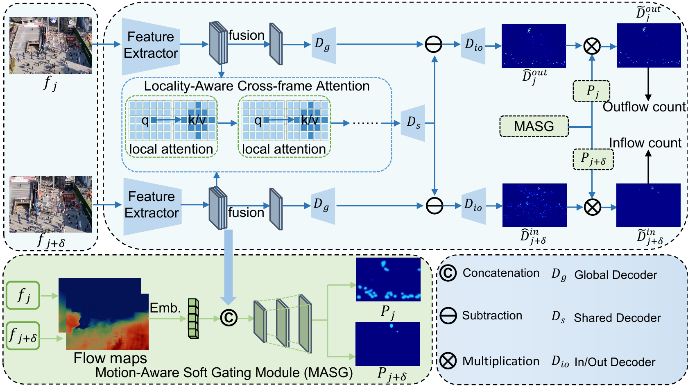

# SMANet: Probabilistic Gating and Neighborhood Attention for Video Individual Counting

This repository contains the PyTorch implementation of **SMANet: Probabilistic Gating and Neighborhood Attention for Video Individual Counting**.

**News.** **SMANet: Probabilistic Gating and Neighborhood Attention for Video Individual Counting** has been accepted for presentation at ICIG 2026.

<p align="center">
  
</p>

## Catalog

- [Supported Datasets](#supported-datasets)
- [Environment](#environment)
- [Dataset Preparation](#dataset-preparation)
- [Configuration](#configuration)
- [Training](#training)
- [Testing](#testing)
- [Model Zoo](#model-zoo)
- [Citation](#citation)
- [Acknowledgement](#acknowledgement)

## Supported Datasets

| Dataset name in code | Aliases | Dataset link | Default root variable | Flow root variable |
| --- | --- | --- | --- | --- |
| `MovingDroneCrowd` | `MDC` | [MovingDroneCrowd](https://github.com/fyw1999/MovingDroneCrowd) | `MDC_DATA_ROOT` | `MDC_FLOW_ROOT` |
| `CroHD` | `HT21` | [CroHD Head Tracking 21](https://www.kaggle.com/datasets/hoangxuanviet/crohd-head-tracking-21) | `CROHD_DATA_ROOT` | `CROHD_FLOW_ROOT` or `HT21_FLOW_ROOT` |
| `SENSE` | `SenseCrowd` | [VSCrowd / SenseCrowd](https://github.com/HopLee6/VSCrowd-Dataset) | `SENSE_DATA_ROOT` | `SENSE_FLOW_ROOT` |

Raw datasets, generated optical flow files, training logs, and checkpoints are not included in this repository. Please download each dataset from its official source and confirm that your use complies with the corresponding license.

## Environment

The tested environment uses Python 3.11, PyTorch 2.10.0+cu130, torchvision 0.25.0+cu130, CUDA 13.0, and [NATTEN](https://github.com/SHI-Labs/NATTEN) 0.21.5. The versions in `requirements.txt` are locked to this environment. Other CUDA/PyTorch combinations are not part of the verified setup and require a matching NATTEN wheel.

```bash
conda create -n vic python=3.11 -y
conda activate vic

# Install the tested CUDA 13.0 PyTorch wheels first.
pip install \
  --index-url https://download.pytorch.org/whl/cu130 \
  torch==2.10.0+cu130 \
  torchvision==0.25.0+cu130

pip install -r requirements.txt
```

If `natten==0.21.5` cannot resolve a wheel for the installed CUDA/PyTorch pair, install the matching wheel following the [official NATTEN instructions](https://github.com/SHI-Labs/NATTEN), then rerun `pip install -r requirements.txt`. This release does not depend on MMCV, COCO APIs, or SDNet's extra benchmarking utilities.

## Dataset Preparation

SMANet expects precomputed RAFT optical flow stored as `.pt` files. The preparation scripts are under `datasets/dataset_prepare/`.

When `--raft_weights` is not provided, the scripts use `torchvision.models.optical_flow.Raft_Large_Weights.DEFAULT`; torchvision will use its local cache if available and may download the RAFT-Large weights on first use. For offline machines, set `RAFT_WEIGHTS=/path/to/raft_large.pth` or pass `--raft_weights /path/to/raft_large.pth`.

Custom RAFT checkpoints are loaded strictly by default. If a checkpoint is intentionally known to have missing or extra keys, pass `--allow_non_strict_weights`; the script will then print the complete missing and unexpected key lists.

The frame interval range used for flow generation must cover the interval range used by the corresponding dataset setting. The default ranges are MDC `3-8`, CroHD/HT21 `95-105`, and SENSE/SenseCrowd `10-20`. Each command writes both directions, for example `1_to_5.pt` and `5_to_1.pt`.

### MovingDroneCrowd

The MDC script accepts one split list at a time. Run it once for every split that will be used.

```bash
export MDC_DATA_ROOT=/path/to/MovingDroneCrowd
export MDC_FLOW_ROOT=/path/to/MovingDroneCrowd/raft

for split in train val test; do
  python datasets/dataset_prepare/MovingDroneCrowd_raft.py \
    --data_root "$MDC_DATA_ROOT" \
    --output_root "$MDC_FLOW_ROOT" \
    --train_txt "$MDC_DATA_ROOT/${split}.txt" \
    --batch_size 8
done
```

The MDC preparation script is single-GPU. Select its GPU before running it, for example:

```bash
CUDA_VISIBLE_DEVICES=0 python datasets/dataset_prepare/MovingDroneCrowd_raft.py \
  --data_root "$MDC_DATA_ROOT" \
  --output_root "$MDC_FLOW_ROOT" \
  --train_txt "$MDC_DATA_ROOT/train.txt"
```

### SENSE / SenseCrowd

The SENSE script supports multiple GPU worker processes. Generate flow for both the training and evaluation split lists:

```bash
export SENSE_DATA_ROOT=/path/to/SENSE
export SENSE_FLOW_ROOT=/path/to/SENSE/raft

for split in train test; do
  python datasets/dataset_prepare/SENSE_raft.py \
    --input_root "$SENSE_DATA_ROOT/videos" \
    --output_root "$SENSE_FLOW_ROOT" \
    --split_txt "$SENSE_DATA_ROOT/${split}.txt" \
    --num_gpus 2 \
    --gpu_ids 0 1 \
    --batch_size 8
done
```

### CroHD / HT21

The CroHD script supports multiple GPU worker processes. Pass every split needed by the current dataset installation:

```bash
export CROHD_DATA_ROOT=/path/to/CroHD_or_HT21
export CROHD_FLOW_ROOT=/path/to/CroHD_or_HT21/raft

python datasets/dataset_prepare/CroHD_raft.py \
  --data_root "$CROHD_DATA_ROOT" \
  --output_root "$CROHD_FLOW_ROOT" \
  --splits train val test \
  --num_gpus 2 \
  --gpu_ids 0 1 \
  --batch_size 8
```

If the installation has no `val/` directory, use `--splits train test`. Existing flow files are skipped by default; add `--no_skip_existing` to regenerate them.

## Configuration

There are two equivalent ways to configure experiments.

### Option A: environment variables

This is the recommended way for normal use because it avoids editing source files.

```bash
export CUDA_VISIBLE_DEVICES=0
export VIC_DATASET=MovingDroneCrowd
export VIC_EXP_NAME=smanet_mdc
export VIC_MAX_EPOCH=60
export VIC_VAL_INTERVAL=1
export VIC_START_VAL=0
export VIC_PRINT_FREQ=20
```

Set the dataset root and optical-flow root for the selected dataset:

```bash
# MovingDroneCrowd
export MDC_DATA_ROOT=/path/to/MovingDroneCrowd
export MDC_FLOW_ROOT=/path/to/MovingDroneCrowd/raft

# SENSE / SenseCrowd
export SENSE_DATA_ROOT=/path/to/SENSE
export SENSE_FLOW_ROOT=/path/to/SENSE/raft

# CroHD / HT21
export CROHD_DATA_ROOT=/path/to/CroHD_or_HT21
export CROHD_FLOW_ROOT=/path/to/CroHD_or_HT21/raft
```

### Option B: edit config files

If you prefer fixed local settings, edit:

- `config.py`: experiment name, dataset, epoch count, validation interval, resume/pretrain paths.
- `datasets/setting/MovingDroneCrowd.py`: MovingDroneCrowd paths and intervals.
- `datasets/setting/SENSE.py`: SENSE/SenseCrowd paths and intervals.
- `datasets/setting/CroHD.py`: CroHD/HT21 paths and intervals.

Use the canonical names `MovingDroneCrowd`, `SENSE`, and `CroHD` for `VIC_DATASET`. The setting package also accepts the aliases `MDC`, `SenseCrowd`, and `HT21`.

Common dataset interval defaults:

| Dataset | Train interval | Test interval |
| --- | --- | ---: |
| MovingDroneCrowd | 3-8 | 4 |
| SENSE / SenseCrowd | 10-20 | 15 |
| CroHD / HT21 | 95-105 | 100 |

## Training

### Single-GPU training

```bash
# MovingDroneCrowd
export CUDA_VISIBLE_DEVICES=0
export VIC_DATASET=MovingDroneCrowd
export MDC_DATA_ROOT=/path/to/MovingDroneCrowd
export MDC_FLOW_ROOT=/path/to/MovingDroneCrowd/raft
python -u train.py
```

```bash
# SENSE / SenseCrowd
export CUDA_VISIBLE_DEVICES=0
export VIC_DATASET=SenseCrowd
export SENSE_DATA_ROOT=/path/to/SENSE
export SENSE_FLOW_ROOT=/path/to/SENSE/raft
python -u train.py
```

```bash
# CroHD / HT21
export CUDA_VISIBLE_DEVICES=0
export VIC_DATASET=CroHD
export CROHD_DATA_ROOT=/path/to/CroHD_or_HT21
export CROHD_FLOW_ROOT=/path/to/CroHD_or_HT21/raft
python -u train.py
```

### Distributed training

```bash
export CUDA_VISIBLE_DEVICES=0,1
export VIC_DATASET=MovingDroneCrowd
export MDC_DATA_ROOT=/path/to/MovingDroneCrowd
export MDC_FLOW_ROOT=/path/to/MovingDroneCrowd/raft

torchrun --standalone --nproc_per_node=2 --master_port=29527 train.py
```

Training outputs are written to `exp/`. This directory is ignored by git.

For example, to train MDC on GPUs 0 and 1:

```bash
CUDA_VISIBLE_DEVICES=0,1 \
VIC_DATASET=MovingDroneCrowd \
MDC_DATA_ROOT=/path/to/MovingDroneCrowd \
MDC_FLOW_ROOT=/path/to/MovingDroneCrowd/raft \
torchrun --standalone --nproc_per_node=2 --master_port=29527 train.py
```

Use `VIC_MAX_EPOCH`, `VIC_TRAIN_NUM_WORKERS`, `VIC_VAL_NUM_WORKERS`, and `VIC_EXP_NAME` to adjust the run without editing source files. For a short data-loading smoke test, set `VIC_SMOKE_MAX_ITERS`, for example `VIC_SMOKE_MAX_ITERS=20`; smoke mode exits before validation. Validation visualization is disabled by default to avoid retaining long videos in memory; enable it explicitly with `VIC_SAVE_VAL_VISUAL=1`.

### Resume or initialize from a checkpoint

```bash
# Resume a full training state.
export VIC_RESUME=1
export VIC_RESUME_PATH=/path/to/latest_state.pth

# Optionally initialize model weights from a pretrained checkpoint.
export VIC_PRETRAIN_COUNTER=/path/to/pretrained_or_released_model.pth
```

## Testing

Put the released checkpoint under `checkpoints/` or pass its path with `--model_path`.

### MovingDroneCrowd

```bash
python test.py \
  --DATASET MovingDroneCrowd \
  --data_path "$MDC_DATA_ROOT" \
  --flow_root "$MDC_FLOW_ROOT" \
  --model_path checkpoints/MDC_SMANet.pth \
  --test_intervals 4 \
  --test_name smanet_mdc \
  --GPU_ID 0 \
  --no-save_visual
```

### SENSE / SenseCrowd

```bash
python test.py \
  --DATASET SENSE \
  --data_path "$SENSE_DATA_ROOT" \
  --flow_root "$SENSE_FLOW_ROOT" \
  --model_path checkpoints/MDC_SMANet.pth \
  --test_intervals 15 \
  --test_name smanet_sense \
  --GPU_ID 0 \
  --no-save_visual
```

### CroHD / HT21

```bash
python test.py \
  --DATASET CroHD \
  --data_path "$CROHD_DATA_ROOT" \
  --flow_root "$CROHD_FLOW_ROOT" \
  --model_path checkpoints/MDC_SMANet.pth \
  --test_intervals 100 \
  --test_name smanet_crohd \
  --GPU_ID 0 \
  --no-save_visual
```

The main printed metrics are video-level `MAE`, `MSE`, and `WRAE`. For MovingDroneCrowd and SENSE, `frame_mae` and `frame_mse` are auxiliary frame-level global-density counting errors.

Use `--test_split val` to evaluate the validation list. CroHD/HT21 test scenes do not have frame-level labels in this implementation; they are evaluated using the hard-coded scene totals in `test.py`.

## Model Zoo

Download links for released checkpoints will be updated here.

| Model | Dataset | Backbone | Checkpoint |
| --- | --- | --- | --- |
| SMANet | MovingDroneCrowd | VGG16-FPN | To be updated |

## Notes for Open-Source Release

- Do not commit raw datasets, generated optical flow, checkpoints, logs, or local visual outputs.
- Before making the repository public, scan the final repository and git history with tools such as `gitleaks` or `trufflehog`.
- If a secret or private path appears in git history, rewrite history or create a clean repository before public release.
- Confirm every dataset license before redistributing data or derived annotations.

## Citation

The citation will be updated after the official ICIG 2026 proceedings are released.

```bibtex
```

## Funding

This work was supported by the National Natural Science Foundation of China under Grant Nos. 62441232, 6250071949, 62476068, and 62302474; the 2025 Hong Kong Scholars Program; and the Shandong Provincial Natural Science Foundation under Project Nos. ZR2025ZD01 and ZR2025QC1520.

## Acknowledgement

We thank the authors of SDNet and GD3A for their open-source projects and benchmarks, especially the MovingDroneCrowd repository: https://github.com/fyw1999/MovingDroneCrowd.
